# ShiftRoster — Open-Source Shift Scheduling & Team Operations Platform

[](https://github.com/rushikeshsakharleofficial/ShiftRoster/actions/workflows/deploy.yml)
[](https://opensource.org/licenses/Apache-2.0)
[](https://fastapi.tiangolo.com/)
[](https://react.dev/)
[](https://www.mongodb.com/)
[](https://vitejs.dev/)

**ShiftRoster** is a self-hosted, open-source operational platform for shift-based teams — hospitals, warehouses, security ops, manufacturing, and any 24/7 operation. One Docker Compose stack replaces your scheduling spreadsheet, WhatsApp group, shared Google Drive, and task tracker with a unified, encrypted, audited workspace.

> **No SaaS dependency. No per-seat cost. Runs on your own server.**

---

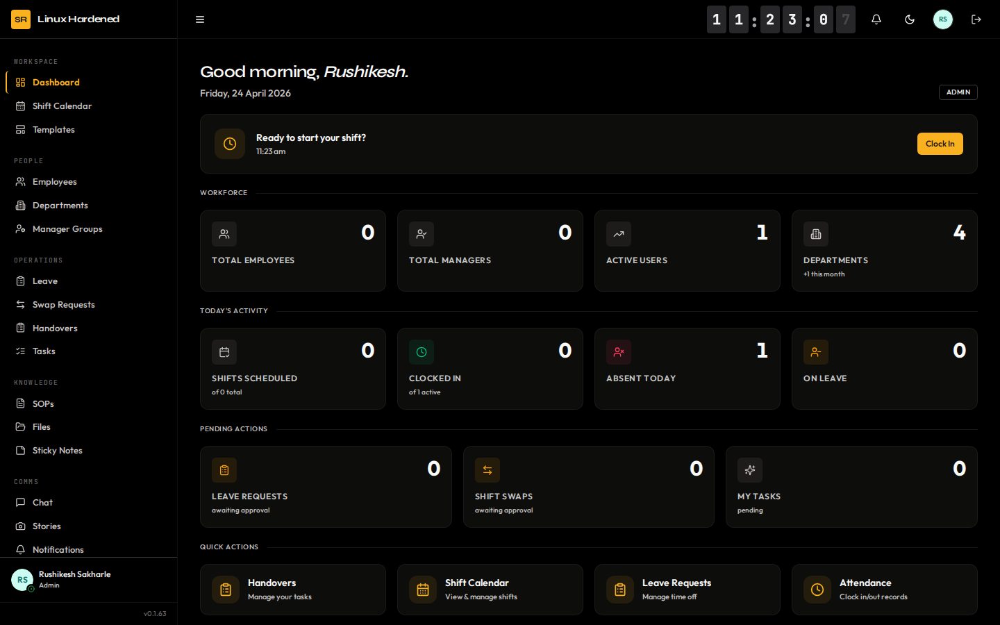

---

## Table of Contents

- [Why ShiftRoster](#why-shiftroster)
- [Features](#features)
- [Screenshots](#screenshots)
- [Tech Stack](#tech-stack)
- [Architecture](#architecture)
- [Quick Start](#quick-start)
- [Environment Variables](#environment-variables)
- [Security](#security)
- [Development](#development)
- [Contributing](#contributing)
- [License](#license)

---

## Why ShiftRoster

Most shift management tools are either:
- **Too simple** — scheduling only, no comms or document management
- **Too expensive** — enterprise SaaS with per-seat pricing
- **Too fragmented** — 4–5 tools stitched together with Zapier

ShiftRoster puts scheduling, encrypted messaging, SOPs, file management, task handovers, and attendance in one place — self-hosted, open source, zero recurring cost.

**Who uses it:** Security operations centers, hospital departments, manufacturing floors, logistics hubs, IT on-call teams, any team running 24/7 rotational shifts.

---

## Features

### Intelligent Shift Scheduling
- Interactive drag-and-drop calendar (day, week, month views)
- RRULE-based recurrence engine for repeating shifts
- Reusable shift templates
- Automated conflict detection on assignment
- Public holiday management
- Swap request workflow with manager approval
- Leave management with multi-level approval

### End-to-End Encrypted Team Messaging
- Real-time channels (public/private) and direct messages
- **E2EE**: P-256 ECDH key exchange + AES-256-GCM message payloads
- BIP39 mnemonic backup for private key recovery
- Thread replies, emoji reactions, file attachments
- Compact slide-over panel (stays open while you work) + full-screen mode
- 24-hour disappearing Stories
- WebSocket typing indicators, read receipts, presence

### Centralized File Manager
- Private and org-wide shared storage scopes
- Native in-browser previews: PDF, DOCX, XLSX, Markdown, JSON, images, video, audio
- Folder hierarchy, upload progress, drag-and-drop
- Admin-configurable max file size limit
- Attach library files directly in chat

### Standard Operating Procedures (SOPs)
- Rich editor: documents (Tiptap), presentations (slides), spreadsheets, checklists
- Version history with one-click revert
- Proposal → approval workflow for non-admin users
- Acknowledgement tracking per team member
- PDF and CSV export

### Task & Shift Handover
- Structured digital handover logbook
- Task cascading across shift transitions — zero information loss
- Task assignment, transfer, notes, completion tracking

### Attendance & Presence
- Clock-in/clock-out tied to active shift assignments
- Extend-shift functionality for overruns
- Real-time online user presence (WebSocket)
- Late/absence reporting

### Enterprise Identity & Access
- Roles: `admin`, `manager`, `employee`
- Manager Groups: scope managers to specific departments only
- IAM groups with resource-action permission rules
- Multi-Factor Authentication (TOTP + backup codes)
- Admin-mandated MFA enforcement
- LDAP / Active Directory sync
- Slack OIDC and Google OIDC single sign-on
- Manager nomination workflow

### Reporting & Audit
- Attendance overview, trend charts, CSV export
- Shift coverage reports by department
- Immutable audit log — every admin action recorded with actor and diff
- Notification feed with security alerts

---

## Screenshots

### Dashboard


### Shift Calendar
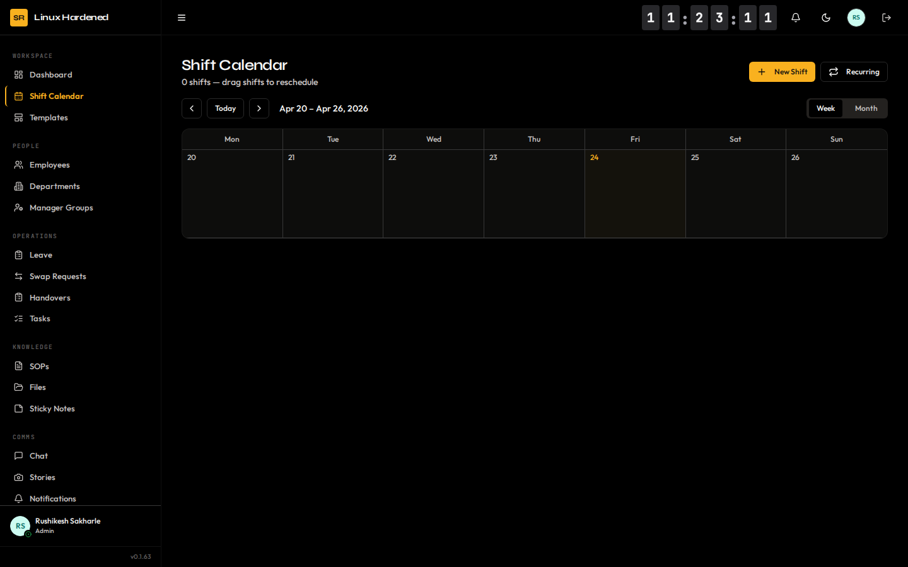

### Encrypted Team Chat
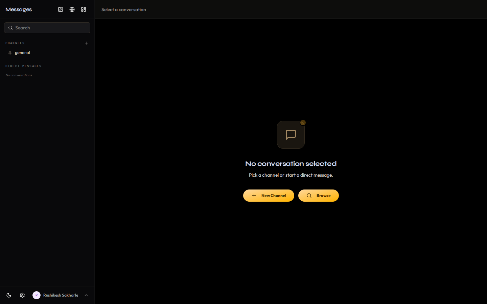

### File Manager
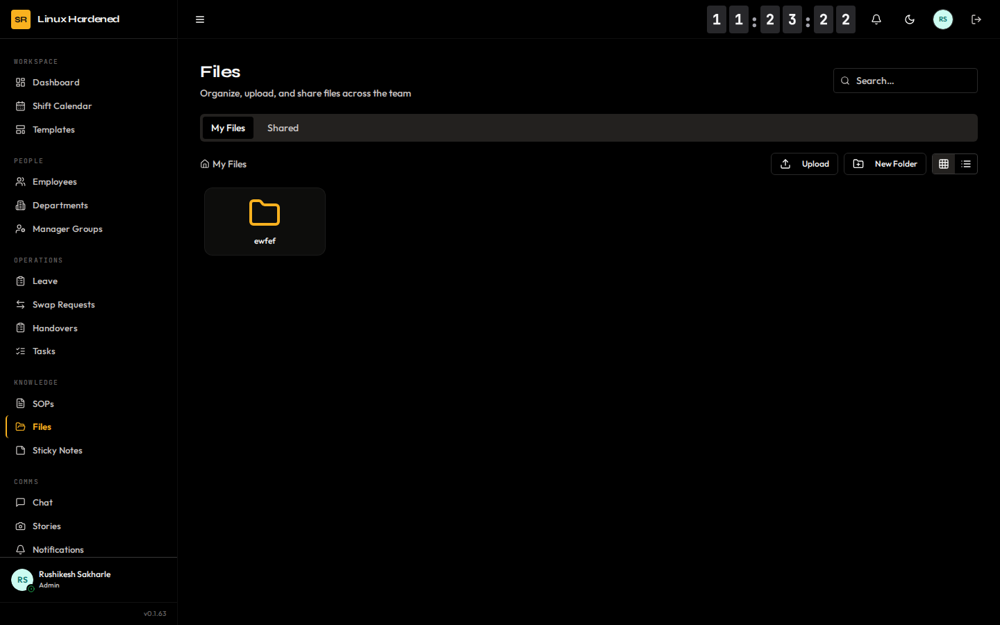

### Standard Operating Procedures
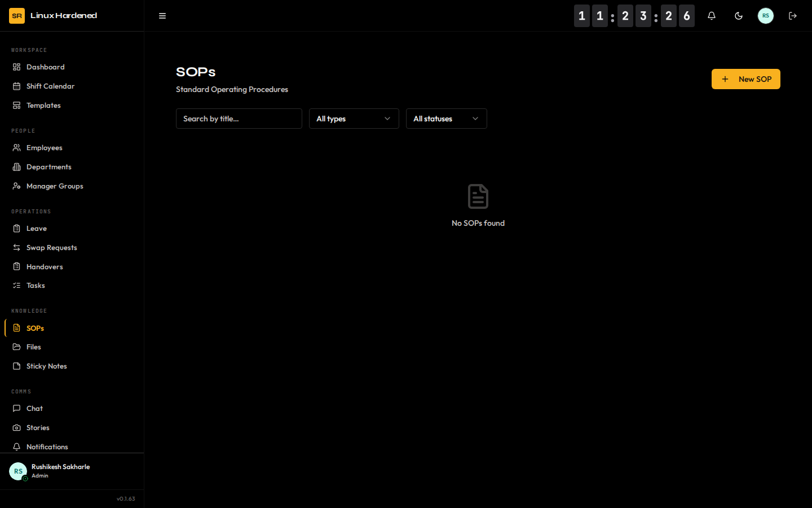

### Task Management
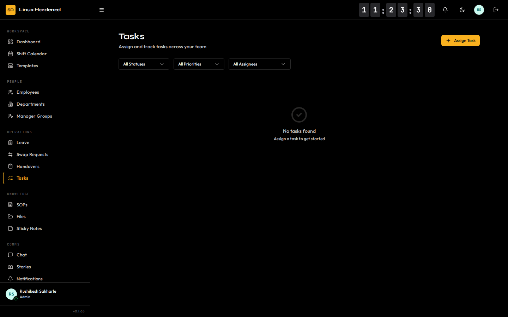

### Attendance Tracking
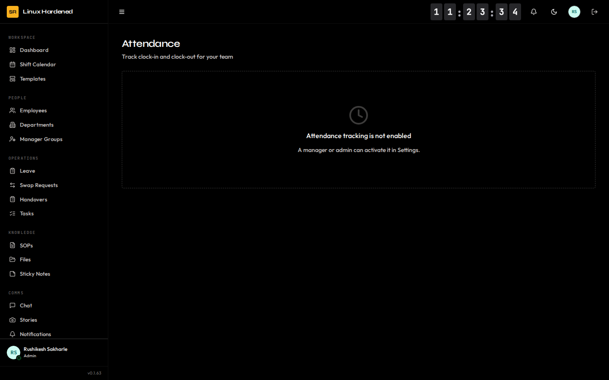

### Leave Management
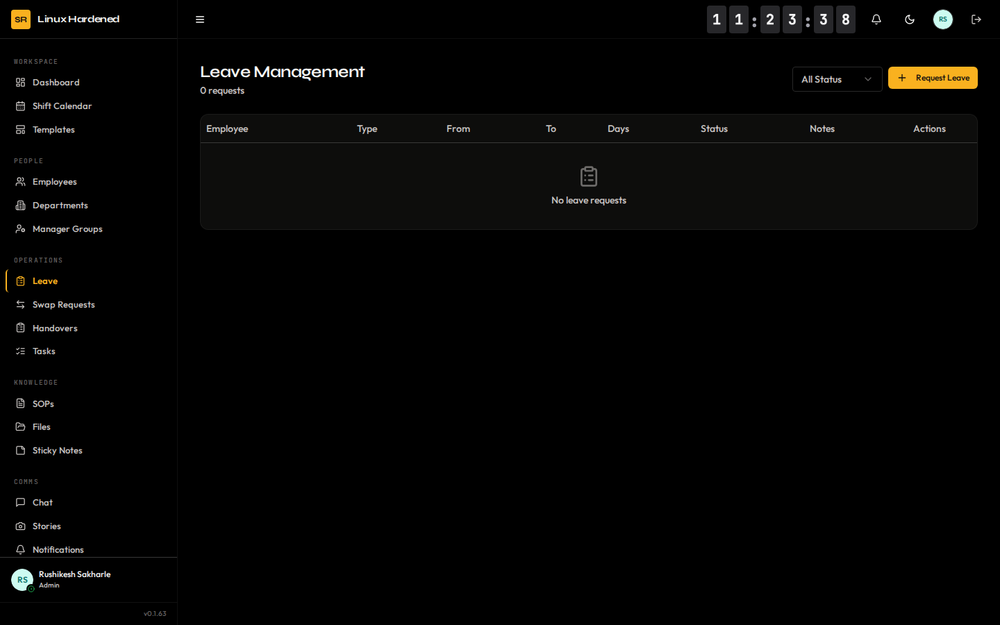

### Reports
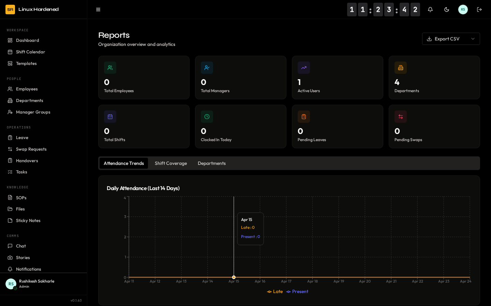

### Employee Directory
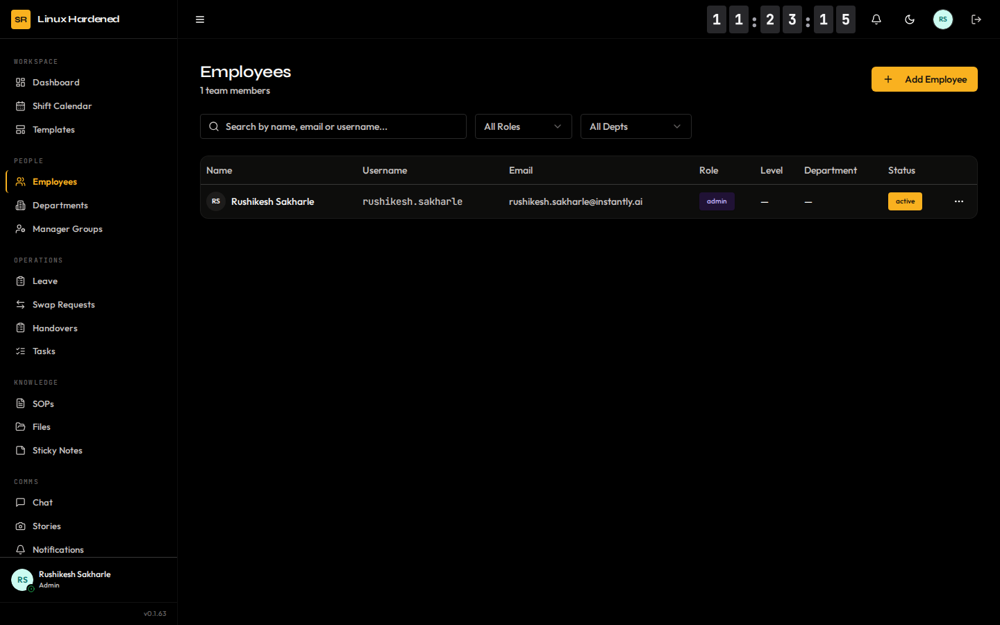

### Settings & Configuration
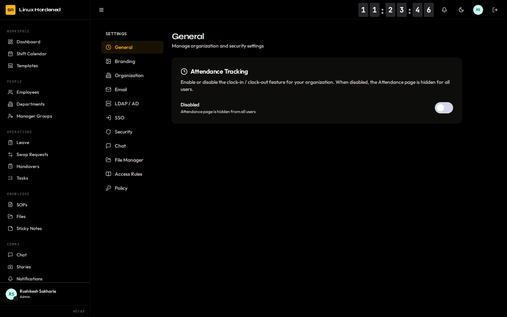

---

## Tech Stack

| Layer | Technology |
|---|---|
| Backend framework | FastAPI 0.115 (Python 3.11+) |
| Database | MongoDB 7 + Motor async driver |
| Real-time | WebSocket — presence, chat events, typing |
| Auth | PyJWT (HTTP-only cookies), Bcrypt, PyOTP (TOTP MFA) |
| Encryption | Python Cryptography (Fernet/AES-256-GCM) + WebCrypto API |
| Frontend framework | React 19 + Vite 6 |
| Routing | React Router 7 |
| Styling | Tailwind CSS 3 + shadcn/ui + Radix UI |
| Animation | Framer Motion |
| Rich text | Tiptap (document editor) |
| File parsing | mammoth (DOCX), ExcelJS (XLSX), JSZip |
| HTML sanitization | DOMPurify |
| Reverse proxy | Nginx (SSL termination, rate limiting, CSP headers) |
| Containerization | Docker + Docker Compose |
| CI/CD | GitHub Actions (self-hosted runner) |

---

## Architecture

```
ShiftRoster/
├── backend/
│   ├── routes/              # Domain API modules
│   │   ├── auth.py          # Login, MFA, SSO, password reset
│   │   ├── chat.py          # Channels, DMs, messages, file upload
│   │   ├── filemanager.py   # File manager CRUD + streaming download
│   │   ├── sops.py          # SOP CRUD, versioning, approval flow
│   │   ├── shifts.py        # Shifts, recurrence, conflict detection
│   │   ├── users.py         # User management, avatars, presence
│   │   ├── iam.py           # IAM groups and permission rules
│   │   ├── operations.py    # Org settings, LDAP, branding
│   │   └── ...              # Leave, attendance, tasks, handovers, reports
│   ├── tasks/               # Background jobs (data purging, reminders)
│   ├── server.py            # App entrypoint, WebSocket handler
│   ├── auth_utils.py        # JWT, MFA, permission helpers
│   ├── presence_manager.py  # WebSocket presence tracking
│   ├── db.py                # MongoDB connection pool
│   └── Dockerfile
│
├── frontend/
│   ├── src/
│   │   ├── pages/           # 25+ page components
│   │   ├── components/      # Shared UI (layout, chat, ui primitives)
│   │   ├── contexts/        # AuthContext, ChatContext
│   │   ├── lib/
│   │   │   ├── api.js       # Axios instance + all API calls
│   │   │   └── crypto.js    # WebCrypto E2EE helpers
│   │   └── hooks/
│   └── Dockerfile
│
├── nginx/
│   ├── entrypoint.sh        # Dynamic nginx config (HTTP/HTTPS, rate limiting, CSP)
│   └── Dockerfile
│
├── docs/screenshots/        # README screenshots
└── docker-compose.yml
```

---

## Quick Start

### Prerequisites
- Docker + Docker Compose
- A Linux server with at least 1 GB RAM

### 1. Clone and configure

```bash
git clone https://github.com/rushikeshsakharleofficial/ShiftRoster.git
cd ShiftRoster
cp .env.example .env
```

### 2. Generate required secrets

```bash
# JWT secret (minimum 32 characters)
openssl rand -hex 32

# Message encryption key (Fernet)
python3 -c "from cryptography.fernet import Fernet; print(Fernet.generate_key().decode())"

# MongoDB password
openssl rand -hex 16
```

Fill the generated values into `.env`.

### 3. Launch

```bash
docker compose up -d --build
```

### 4. First-time setup

Visit `http://localhost:8080/setup` to create the initial SuperAdmin account.

### HTTPS (production)

Place your SSL certificate and key in `./ssl/`:
```
ssl/cert.pem
ssl/key.pem
```

Set in `.env`:
```
DOMAIN=yourdomain.com
PROTOCOL=https
APP_URL=https://yourdomain.com
```

---

## Environment Variables

| Variable | Required | Default | Description |
|---|---|---|---|
| `JWT_SECRET` | ✅ | — | JWT signing secret, min 32 chars |
| `MONGO_PASSWORD` | ✅ | — | MongoDB root password |
| `MSG_ENCRYPT_KEY` | ✅ | — | Fernet key for DB field encryption |
| `APP_URL` | ✅ for email | `http://localhost` | Public URL — used in password reset links |
| `SECURE_COOKIES` | — | `true` | Set `false` only for local HTTP dev |
| `MONGO_USER` | — | `shiftroster` | MongoDB username |
| `DOMAIN` | — | `localhost` | Nginx server name |
| `PROTOCOL` | — | `http` | `http` or `https` |

> **`APP_URL` must be set** before enabling SMTP or password reset emails. Without it, reset links default to `http://localhost`.

---

## Security

### Protections in place

| Threat | Mitigation |
|---|---|
| XSS | DOMPurify sanitizes all user-authored HTML (SOPs, DOCX previews) |
| Path traversal | File deletion validates containment within `UPLOADS_DIR` |
| Malicious uploads | Extension blocklist + MIME whitelist on all upload endpoints |
| Host header injection | Password reset links use server-controlled `APP_URL` env var |
| Brute force | Nginx rate limiting: 5 req/min on auth endpoints |
| Session hijack | HTTP-only Secure cookies, refresh token rotation |
| Privilege escalation | MFA reset restricted to `admin` role only, org-scoped |
| Data exposure | Immutable audit log on all admin actions |
| Dependency CVEs | pip-audit + npm audit in CI on every push |

### Known limitations

- **Backend runs as root** inside the container — the `backend_uploads` Docker named volume is root-owned. Acceptable on a private/internal network behind nginx. To harden: implement a `gosu`-based entrypoint to drop privileges after `chown`.
- **CSP allows `unsafe-inline`** — removing it requires nonce-based CSP (frontend refactor). Tracked.
- **MIME validation is client-supplied** — no magic-byte check. Extension blocklist is the primary guard.

### Security configuration checklist

- [ ] `JWT_SECRET` set to 32+ random chars
- [ ] `SECURE_COOKIES=true` (default)
- [ ] `APP_URL` set to public domain
- [ ] SSL certs in `./ssl/`, `PROTOCOL=https`
- [ ] SMTP configured in Settings for password reset emails
- [ ] MFA mandate enabled for admin/manager in Settings → Security

---

## Development

### Backend

```bash
cd backend
python -m venv venv && source venv/bin/activate
pip install -r requirements.txt
uvicorn server:app --reload --port 8000
```

Create `backend/.env`:
```
MONGO_URL=mongodb://localhost:27017
DB_NAME=shiftroster_dev
JWT_SECRET=dev-secret-at-least-32-chars-long
MSG_ENCRYPT_KEY=<fernet key>
```

### Frontend

```bash
cd frontend
npm install --legacy-peer-deps
npm run dev       # dev server on :3000
npm run build     # production build → ./build/
```

Create `frontend/.env.local`:
```
REACT_APP_BACKEND_URL=http://localhost:8000
```

### Run tests

```bash
# Backend
cd backend && pytest

# Frontend
cd frontend && npm run test
```

---

## CI/CD

Every push to `master` triggers:
1. **Code Review** — flake8 (syntax), bandit (security), pip-audit (CVEs), npm audit, frontend build
2. **Version Bump** — auto-increments patch version
3. **Deploy** — self-hosted runner runs `docker compose up -d --build` on the production server

---

## Contributing

1. Fork and create a feature branch from `master`
2. Follow the Midnight Shift design system: amber primary (`hsl(38,92%,46%)`), Syne/Outfit fonts, Linear-style sidebar
3. Backend: add integration tests in `backend/tests/integration/` for new routes
4. Frontend: no `console.log` in production code (stripped at build time)
5. Open a PR — CI must pass before merge

---

## License

Licensed under the [Apache License 2.0](https://opensource.org/licenses/Apache-2.0).

---

*Built for elite operations teams. Self-hosted. Encrypted. Audited.*
